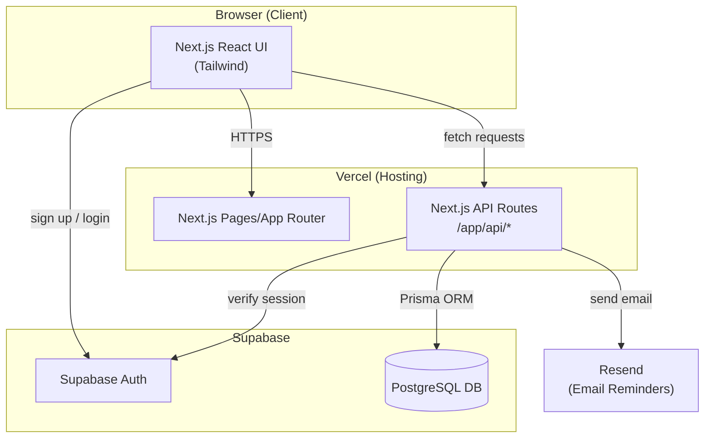
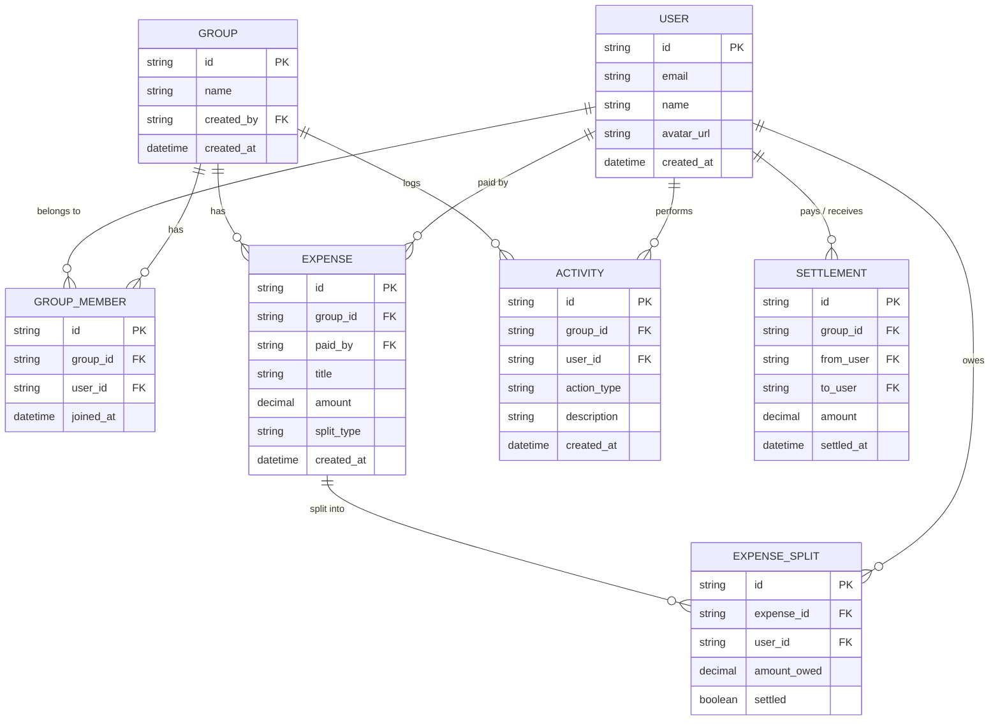

# FairShare — Architecture Plan (v1 MVP)

**Product:** Smart Bill Splitter / Group Expense Tracker
**Builder:** Solo, using Claude Code
**Platform:** Web app only
**Cost target:** $0/month at launch (free tiers only)

---

## 1. Product Scope (v1)

| In scope (v1) | Out of scope (v2+) |
|---|---|
| Auth (sign up / login) | Receipt photo OCR (AI) |
| Create / join groups | Real payment processing (Stripe/UPI) |
| Add expense (manual entry) | Multi-currency |
| Equal / custom / percentage split | Recurring expenses |
| Balances dashboard (who owes whom) | Mobile app |
| Email payment reminders | Item-level splitting |
| Activity feed | Push notifications |
| Mark as settled (manual) | |

---

## 2. Tech Stack (Final)

| Layer | Choice | Notes |
|---|---|---|
| Framework | **Next.js 14+ (App Router)** | React frontend + backend API routes, one repo |
| Styling | **Tailwind CSS** | Fast to build, works well with Claude Code |
| Database | **PostgreSQL (Supabase)** | Free tier: 500MB DB, 50k monthly active users |
| Auth | **Supabase Auth** | Email/password + optional Google OAuth |
| ORM | **Prisma** | Type-safe DB access, easy migrations |
| Email | **Resend** | Free tier: 3,000 emails/month |
| Hosting | **Vercel** | Free tier, auto-deploy from GitHub |
| Version control | **GitHub** | Private repo |

**Total monthly cost at launch: $0**

---

## 3. High-Level System Architecture



**Flow summary:** User interacts with Next.js frontend → frontend calls Next.js API routes → API routes verify the user via Supabase Auth → API routes read/write data via Prisma → Postgres (Supabase) → reminder emails sent via Resend.

---

## 4. Database Schema (ER Diagram)



### Table notes
- **split_type**: `EQUAL` | `CUSTOM` | `PERCENTAGE`
- **EXPENSE_SPLIT.settled**: flips to `true` once that member's share is marked paid
- **SETTLEMENT**: a record created whenever someone manually marks a debt as paid (this is what powers the "who owes whom" simplification)
- Balances are **calculated on read** (sum of EXPENSE_SPLIT minus SETTLEMENT per user pair) — no need to store a running balance separately for v1

---

## 5. API Routes (Next.js App Router)

```
/app/api/
├── auth/
│   └── callback/route.ts          # Supabase auth callback
├── groups/
│   ├── route.ts                   # GET (list my groups), POST (create group)
│   └── [groupId]/
│       ├── route.ts               # GET group details, DELETE group
│       ├── members/route.ts       # POST invite/add member
│       ├── expenses/
│       │   ├── route.ts           # GET expenses, POST new expense
│       │   └── [expenseId]/route.ts  # GET/PATCH/DELETE single expense
│       ├── balances/route.ts      # GET calculated balances for group
│       ├── settle/route.ts        # POST mark a debt as settled
│       └── activity/route.ts      # GET activity feed
└── reminders/
    └── send/route.ts              # POST trigger reminder email
```

---

## 6. Project Folder Structure

```
fairshare/
├── app/
│   ├── (auth)/
│   │   ├── login/page.tsx
│   │   └── signup/page.tsx
│   ├── (dashboard)/
│   │   ├── groups/
│   │   │   ├── page.tsx                # list of groups
│   │   │   └── [groupId]/
│   │   │       ├── page.tsx            # group detail + balances
│   │   │       ├── expenses/page.tsx
│   │   │       └── activity/page.tsx
│   │   └── layout.tsx
│   ├── api/                            # (see section 5)
│   └── layout.tsx
├── components/
│   ├── ui/                             # buttons, inputs, cards (Tailwind)
│   ├── ExpenseForm.tsx
│   ├── BalanceCard.tsx
│   ├── GroupList.tsx
│   └── ActivityFeed.tsx
├── lib/
│   ├── prisma.ts                       # Prisma client singleton
│   ├── supabase.ts                     # Supabase client
│   ├── balances.ts                     # balance calculation logic
│   └── email.ts                        # Resend wrapper
├── prisma/
│   └── schema.prisma
├── public/
├── .env.local
├── next.config.js
├── tailwind.config.ts
└── package.json
```

---

## 7. Core Feature Flows

### A. Sign up → Create group
1. User signs up via Supabase Auth (email/password)
2. On first login, redirected to `/groups`
3. User clicks "New Group" → POST `/api/groups` → creates `GROUP` + `GROUP_MEMBER` (self)
4. User invites members by email → adds row to `GROUP_MEMBER` (or a pending-invite state if not yet registered)

### B. Add expense
1. User opens group → "Add Expense"
2. Enters title, amount, who paid, split type
3. POST `/api/groups/[groupId]/expenses`
4. Backend creates `EXPENSE` row + one `EXPENSE_SPLIT` row per member based on split type
5. Activity log entry created

### C. View balances
1. GET `/api/groups/[groupId]/balances`
2. Backend sums all `EXPENSE_SPLIT.amount_owed` per user pair, subtracts any `SETTLEMENT` already made
3. Simplify debts algorithm (minimize number of transactions) runs server-side, returns clean "A owes B $X" list

### D. Settle up
1. User clicks "Mark as paid" next to a balance
2. POST `/api/groups/[groupId]/settle` → creates `SETTLEMENT` record
3. Balances recalculated on next read

### E. Reminders
1. Manual trigger ("Send Reminder" button) or scheduled (cron via Vercel Cron, optional v1.1)
2. POST `/api/reminders/send` → Resend sends email to the owing member

---

## 8. Authentication & Security

- Supabase Auth handles password hashing, sessions, JWT issuance
- Next.js middleware checks session on every `/app/(dashboard)/*` route — redirects to `/login` if unauthenticated
- API routes verify the Supabase session token server-side before any DB write
- Row-level check: every group action verifies the requesting user is a `GROUP_MEMBER` of that group before allowing read/write (prevents users from seeing/editing other people's groups)

---

## 9. Environment Variables

```
# .env.local
DATABASE_URL=              # Supabase Postgres connection string
NEXT_PUBLIC_SUPABASE_URL=
NEXT_PUBLIC_SUPABASE_ANON_KEY=
SUPABASE_SERVICE_ROLE_KEY=
RESEND_API_KEY=
NEXT_PUBLIC_APP_URL=       # e.g. https://fairshare.vercel.app
```

---

## 10. Complete Implementation Phases (VS Code → Live Product)

Work through these in order. Each phase ends with something *runnable/testable* — don't move to the next phase until the current one works. When you get to Claude Code steps, paste the relevant phase section as its instruction so it stays scoped.

---

### Phase 0 — Local machine & accounts setup (no code yet)

**Goal:** every tool and account ready before writing a single line.

1. Confirm installed: `node -v` (need 18.18+), `npm -v`, `git --version`
2. Create accounts (all free tier):
   - GitHub — github.com
   - Supabase — supabase.com
   - Vercel — vercel.com (can sign in with GitHub)
   - Resend — resend.com
3. Install VS Code extensions: **Prisma**, **Tailwind CSS IntelliSense**, **ESLint**

**Checkpoint:** all four accounts created, VS Code ready.

---

### Phase 1 — GitHub repo + local folder structure

1. On GitHub: create a new **empty private repo** named `fairshare` (don't initialize with README — you'll push from local)
2. In VS Code, open a terminal in the folder where you keep projects, then:
   ```bash
   mkdir fairshare
   cd fairshare
   git init
   git branch -M main
   git remote add origin https://github.com/<your-username>/fairshare.git
   ```
3. Open this empty `fairshare` folder in VS Code (`File > Open Folder`)

**Checkpoint:** empty local folder linked to an empty GitHub repo.

---

### Phase 2 — Scaffold Next.js project

1. In the VS Code terminal, from inside `fairshare/`:
   ```bash
   npx create-next-app@latest . --typescript --tailwind --eslint --app --src-dir=false --import-alias "@/*"
   ```
   (Answer "Yes" to using App Router; "No" to Turbopack is fine either way.)
2. Run it locally:
   ```bash
   npm run dev
   ```
   Visit `http://localhost:3000` — you should see the default Next.js page.
3. Commit and push:
   ```bash
   git add .
   git commit -m "Initial Next.js scaffold"
   git push -u origin main
   ```

**Checkpoint:** default Next.js app runs locally and is pushed to GitHub.
**This is your first Claude Code task:** "Set up a Next.js 14 App Router project with TypeScript and Tailwind" (already done manually above — Claude Code picks up from here).

---

### Phase 3 — Supabase project + database connection

1. In Supabase dashboard: create a new project (`fairshare`), choose a region close to you, set a DB password (save it)
2. Go to **Project Settings → Database** → copy the **connection string** (URI, "Transaction" pooling mode)
3. Go to **Project Settings → API** → copy `Project URL` and `anon public` key
4. In VS Code, create `.env.local` in the project root:
   ```
   DATABASE_URL="<supabase connection string>"
   NEXT_PUBLIC_SUPABASE_URL="<project url>"
   NEXT_PUBLIC_SUPABASE_ANON_KEY="<anon key>"
   SUPABASE_SERVICE_ROLE_KEY="<service role key>"
   NEXT_PUBLIC_APP_URL="http://localhost:3000"
   ```
5. Add `.env.local` to `.gitignore` (Next.js does this by default — verify it's there)
6. Install packages:
   ```bash
   npm install prisma @prisma/client @supabase/supabase-js @supabase/ssr
   npx prisma init
   ```

**Checkpoint:** `.env.local` has real Supabase credentials, Prisma installed, nothing committed with secrets.
**Claude Code task:** "Set up Prisma with the schema from architecture section 4, and a Supabase client helper in lib/supabase.ts"

---

### Phase 4 — Database schema + first migration

1. Give Claude Code the ER diagram from **section 4** and ask it to write `prisma/schema.prisma` matching those tables (User, Group, GroupMember, Expense, ExpenseSplit, Settlement, Activity)
2. Run the migration:
   ```bash
   npx prisma migrate dev --name init
   ```
3. Verify tables exist: `npx prisma studio` opens a local DB browser at `localhost:5555`

**Checkpoint:** all 7 tables visible in Prisma Studio and in Supabase's Table Editor.

---

### Phase 5 — Authentication

**Claude Code task:** "Implement Supabase email/password auth: signup page, login page, logout, and middleware that protects all routes under `app/(dashboard)`."

1. Build `/login` and `/signup` pages
2. Build `middleware.ts` to guard dashboard routes
3. Test: sign up a test user, confirm a `USER` row appears in Supabase, log out, log back in

**Checkpoint:** you can sign up, get redirected to a dashboard, log out, and log back in.

---

### Phase 6 — Groups (create, list, view)

**Claude Code task:** "Build the groups feature: POST/GET `/api/groups`, a group list page, and a create-group form. When a group is created, also add the creator as a GROUP_MEMBER."

**Checkpoint:** create 2–3 test groups as your test user, see them listed on `/groups`.

---

### Phase 7 — Add members to a group

**Claude Code task:** "Build an 'invite member' flow on the group detail page — add by email, create a GROUP_MEMBER row."

**Checkpoint:** add a second (test) user to a group and confirm both show as members.

---

### Phase 8 — Expenses (equal split first)

**Claude Code task:** "Build the Add Expense form (title, amount, paid-by, equal split only for now) and the API route that creates one EXPENSE row plus one EXPENSE_SPLIT row per group member."

**Checkpoint:** add an expense, confirm rows appear correctly in Prisma Studio with the right split amounts.

---

### Phase 9 — Balances dashboard (the core value)

**Claude Code task:** "Build the balance calculation logic in `lib/balances.ts`: net each user pair's owed amount from EXPENSE_SPLIT minus SETTLEMENT, then simplify into a minimal list of 'A owes B $X' transactions. Display this on the group page."

**Checkpoint:** with 2–3 test expenses across 2–3 users, the balances shown are mathematically correct — check this by hand.

---

### Phase 10 — Custom & percentage split types

**Claude Code task:** "Extend the Add Expense form to support CUSTOM (enter exact amount per person) and PERCENTAGE split types, validating they sum to the total."

**Checkpoint:** test both split types, confirm balances update correctly.

---

### Phase 11 — Settle up flow

**Claude Code task:** "Add a 'Mark as paid' action next to each balance line that creates a SETTLEMENT row, then re-fetches balances."

**Checkpoint:** settle a debt, confirm the balance disappears/updates.

---

### Phase 12 — Activity feed

**Claude Code task:** "Log an ACTIVITY row whenever an expense is added or a settlement is made, and display a chronological feed on the group page."

**Checkpoint:** feed shows real actions in the right order.

---

### Phase 13 — Email reminders

1. Get a Resend API key, add `RESEND_API_KEY` to `.env.local`
2. **Claude Code task:** "Add a 'Send Reminder' button on unsettled balances that calls `/api/reminders/send`, which emails the owing user via Resend."

**Checkpoint:** trigger a reminder, confirm the email arrives (Resend's test/sandbox domain works fine for this).

---

### Phase 14 — Polish

- Empty states (no groups yet, no expenses yet)
- Mobile responsiveness pass (Tailwind breakpoints)
- Basic landing page at `/` explaining the product before login
- Loading and error states on all forms

**Checkpoint:** app feels usable end-to-end on both desktop and phone browser widths.

---

### Phase 15 — Deploy to production

1. Push all committed code to GitHub (should already be continuous from earlier phases)
2. In Vercel: **Add New Project → Import** your `fairshare` GitHub repo
3. In Vercel's project settings, add the same environment variables from `.env.local`
4. Deploy — Vercel builds and gives you a live `https://fairshare-<something>.vercel.app` URL
5. Test the full flow (signup → group → expense → balance → settle → reminder) on the **live** URL, not just localhost
6. (Optional) connect a custom domain in Vercel's Domains tab

**Checkpoint:** a friend, on their own phone/laptop, can sign up and use FairShare without you running anything locally.

---

### Working with Claude Code — practical tips
- Paste one phase at a time as the task; don't paste the whole document and say "build all of this"
- After each phase, run the app and manually test the checkpoint before starting the next phase
- Commit after every working phase (`git add . && git commit -m "Phase X: ..."`) so you can roll back if a later change breaks something
- If Claude Code's output touches files outside the current phase's scope, ask it to explain why before accepting

---

## 11. Deployment Steps

1. Push code to a GitHub repo
2. Create Supabase project → copy DB URL + API keys into `.env.local`
3. Run `npx prisma migrate dev` to create tables in Supabase
4. Create Resend account → get API key → verify sending domain (or use their test domain initially)
5. Import GitHub repo into Vercel → set the same environment variables in Vercel's dashboard
6. Deploy → Vercel gives you a `*.vercel.app` URL automatically
7. (Optional later) connect a custom domain like `fairshareapp.com`

---

## 12. Future Roadmap (v2+)

- Receipt photo upload + AI extraction (Claude API, Haiku model — see cost notes from earlier)
- Push/SMS reminders
- Recurring expenses (rent, subscriptions)
- Multi-currency support
- Native mobile app
- Real payment settlement (Stripe Connect / UPI integration)

---

**Next step:** Hand this document to Claude Code phase-by-phase (start with Phase 1 in section 10) rather than asking it to build everything at once — this keeps each step reviewable and testable.
